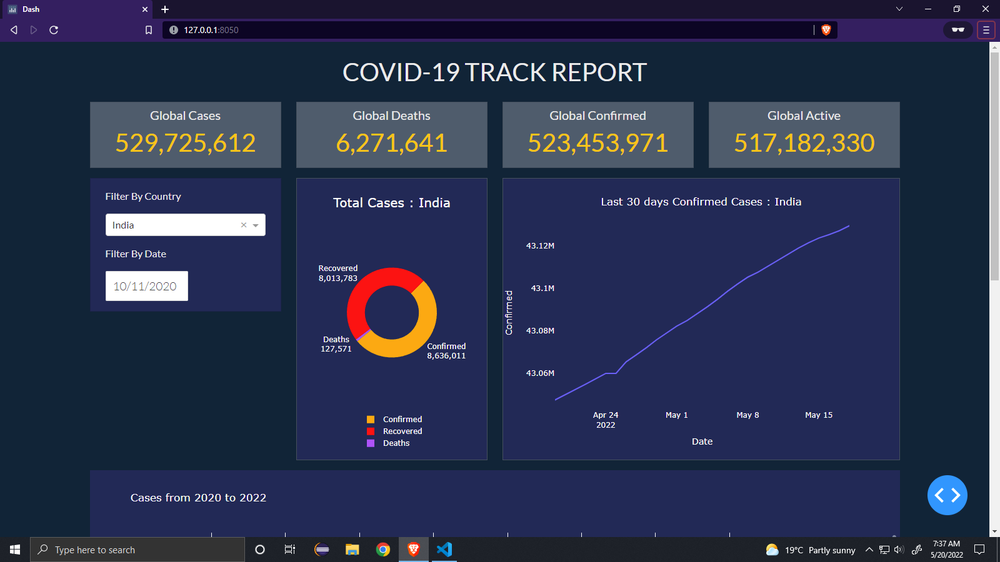

# 📊 Plotly COVID-19 Tracker Dashboard

> Responsive Dashboard made using Plotly Library and Python

### Table of Contents

- [Description](#description)
- [How To Use](#how-to-use)

## Demo screens



## Description

This project is a simple data visualization project, that plots chats based on COVID-19 reports data. 

## Tech Stack 👨🏻‍💻

**Client-Siide:** Bootstrap, HTML, CSS

**Server-Side:** Python, Pandas, Plotly, Numpy


## How to use

There are some packages 📦 that are required to run this project

> ``` pip install plotly-express```
> 
> ``` pip install dash-html-components```
> 
> ``` pip install dash_core_components```
> 
> ``` pip install dash_bootstrap_components```


---

## License

[MIT](https://choosealicense.com/licenses/mit/)
